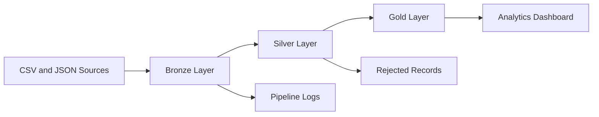

# RetailMart Centralized Data Analytics Platform

RetailMart Centralized Data Analytics Platform is a retail data engineering and business intelligence solution that transforms fragmented CSV and JSON sources into reliable Bronze, Silver and Gold datasets.

The processed data is presented through an interactive React dashboard containing executive, sales, product, customer, inventory, pipeline and data-quality analytics.

## Business Problem

RetailMart receives data from independent order, customer, product and inventory sources. These datasets contain duplicate records, inconsistent formats, invalid dates, missing identifiers and incorrect business values.

These issues make reporting unreliable and increase the effort required to generate business insights.

## Solution

The platform implements a Medallion Architecture to:

- Preserve raw source data
- Clean and standardize records
- Validate business and data-quality rules
- Store rejected records with rejection reasons
- Generate business-ready analytical datasets
- Present important KPIs through interactive dashboards

## Architecture



## Medallion Architecture

### Bronze Layer

The Bronze layer preserves the original source values and adds ingestion metadata:

- `source_file`
- `source_system`
- `ingestion_timestamp`
- `ingestion_id`

Bronze datasets:

- `bronze_orders.csv`
- `bronze_customers.csv`
- `bronze_products.csv`
- `bronze_inventory.csv`

### Silver Layer

The Silver layer performs cleaning, standardization and validation.

Transformations include:

- Removing duplicate records
- Trimming leading and trailing spaces
- Standardizing customer and product names
- Standardizing category, city and region values
- Converting dates to `YYYY-MM-DD`
- Converting quantity, price, sales and profit to numeric values
- Validating customer and product identifiers
- Validating email addresses
- Rejecting zero or negative quantities
- Rejecting negative prices
- Rejecting invalid dates and unknown regions

Silver datasets:

- `silver_orders.csv`
- `silver_customers.csv`
- `silver_products.csv`
- `silver_inventory.csv`

### Gold Layer

The Gold layer contains aggregated, business-ready datasets:

- `monthly_sales.csv`
- `category_performance.csv`
- `regional_performance.csv`
- `product_performance.csv`
- `customer_performance.csv`
- `inventory_summary.csv`
- `executive_kpis.csv`
- `data_quality_summary.csv`

## Key Features

- Executive business dashboard
- Sales and profit analytics
- Product-performance analysis
- Customer-segmentation analysis
- Inventory monitoring
- Low-stock and reorder recommendations
- Bronze, Silver and Gold pipeline visualization
- Pipeline execution history
- Data-quality score monitoring
- Rejected-record inspection
- Search, filtering, sorting and pagination
- CSV export
- Responsive desktop and mobile interface

## Technology Stack

### Frontend

- React
- TypeScript
- Vite
- Tailwind CSS
- shadcn/ui
- Recharts
- Lucide React
- TanStack Router
- TanStack Query

### Data Engineering

- Python
- Pandas
- CSV
- JSON
- Regular expressions
- Python `unittest`

### Development Tools

- Git
- GitHub
- Visual Studio Code
- npm

## Project Structure

```text
retailmart-insights/
├── src/
│   ├── components/
│   ├── data/
│   ├── hooks/
│   ├── lib/
│   ├── routes/
│   ├── router.tsx
│   └── styles.css
├── public/
├── data-pipeline/
│   ├── raw/
│   ├── bronze/
│   ├── silver/
│   ├── gold/
│   ├── rejected/
│   ├── logs/
│   ├── pipeline.py
│   ├── test_pipeline.py
│   ├── requirements.txt
│   └── README.md
├── sample-data/
├── docs/
├── README.md
├── package.json
├── package-lock.json
├── tsconfig.json
└── vite.config.ts
```

## Frontend Setup

### Prerequisites

- Node.js
- npm

### Installation

```bash
git clone https://github.com/riya-saharan/retailmart-insights.git
cd retailmart-insights
npm install
```

### Start the Development Server

```bash
npm run dev
```

### Create a Production Build

```bash
npm run build
```

### Preview the Production Build

```bash
npm run preview
```

## Run the ETL Pipeline

### Prerequisites

- Python 3.10 or later
- pip

### Installation

```bash
cd data-pipeline
pip install -r requirements.txt
```

### Execute the Pipeline

```bash
python pipeline.py
```

The pipeline performs the following steps:

1. Reads raw CSV and JSON source files
2. Creates Bronze datasets with ingestion metadata
3. Cleans and validates records
4. Creates Silver datasets
5. Stores invalid records in the rejected-record dataset
6. Generates Gold analytical datasets
7. Creates a timestamped execution log

## Run Tests

From the `data-pipeline` directory:

```bash
python -m unittest test_pipeline.py
```

The test suite validates:

- Duplicate removal
- Invalid email detection
- Negative quantity rejection
- Invalid region rejection
- Date standardization
- Gold KPI generation

## Source Data

The project contains:

- 15,000 raw order records
- 500+ customer records
- 100 product records
- 100 inventory records
- CSV and JSON source formats
- Duplicate and invalid records for quality testing

## Pipeline Results

The order-processing pipeline produces:

| Metric                   |  Value |
| ------------------------ | -----: |
| Raw order records        | 15,000 |
| Duplicate orders removed |    210 |
| Invalid orders rejected  |    170 |
| Valid Silver orders      | 14,620 |
| Gold datasets generated  |      8 |

## Data-Quality Rules

1. Customer ID cannot be null.
2. Order ID must be unique.
3. Customer ID must exist in the customer dataset.
4. Product ID must exist in the product dataset.
5. Quantity must be greater than zero.
6. Product price cannot be negative.
7. Email must have a valid format.
8. Order date must be valid.
9. Region must be North, South, East, West or Central.
10. Inventory stock and unit cost cannot be negative.

## Rejected-Record Handling

Invalid records are stored in:

```text
data-pipeline/rejected/rejected_records.csv
```

Each rejected record contains:

- Source file
- Record ID
- Rejection reason
- Invalid value
- Rejection timestamp

This provides traceability while allowing valid records to continue through the pipeline.

## Dashboard Modules

### Executive Dashboard

Displays revenue, orders, customers, profit, profit margin, growth and data-quality KPIs.

### Sales Analytics

Provides monthly revenue, profit, category, region and customer-segment analysis.

### Product Analytics

Displays product revenue, profit, units sold, stock and performance status.

### Customer Analytics

Provides customer segmentation, lifetime value, regional distribution and top-customer analysis.

### Inventory Analytics

Tracks inventory value, low-stock products, out-of-stock products and reorder recommendations.

### Data Pipeline

Visualizes Bronze, Silver and Gold processing with execution status and history.

### Data Quality

Displays completeness, uniqueness, validity, consistency and rejected-record statistics.

### Data Explorer

Allows users to inspect Bronze, Silver and Gold datasets with search, pagination and CSV export.

## Dashboard KPIs

- Total Revenue
- Total Orders
- Total Customers
- Average Order Value
- Total Profit
- Profit Margin
- Revenue Growth
- Data Quality Score
- Best Performing Product
- Best Performing Category
- Best Performing Region
- Inventory Status
