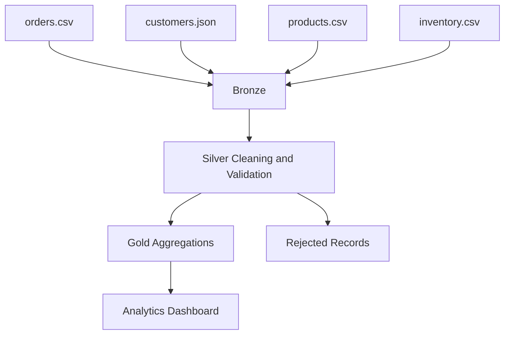

# Architecture

RetailMart uses a file-based Medallion Architecture for a portable demonstration.

The same design can scale to object storage, Delta Lake, PostgreSQL, Spark and orchestration tools.
